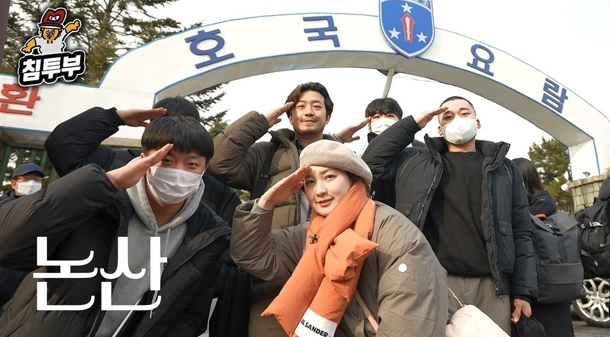

<h1> Hey! Nice to see you.</h1>

 

Welcome to my page!😊
  <b>I'm LEE CHAN, a third-year student at Kyunghee University majoring in <a href="https://ie.khu.ac.kr/ie/user/main/view.do" target="_blank">Industrial and Management Engineering</a>,
and also double majoring in the Data Science track under <a href="http://swcon.khu.ac.kr/wordpress/" target="_blank"> the Department of Software Convergence </a>.</b> 
Currently living in  <b>Seoul, Korea</b>. 

I'm particularly interested in the <b>miniaturization of deep learning models</b> and the <b>application of AI technologies in manufacturing industries</b>.  
My research CV is in here ➡️
<a href="https://docs.google.com/document/d/1YqSugTyW35w0EJWYjQIBH3RQXECPGTlO/edit?usp=sharing&ouid=103500540050225697589&rtpof=true&sd=true"><b>Curriculum Vitae(CV)</b></a>

Contact ➡️ <a href="mailto: chan112500@khu.ac.kr">chan112500@khu.ac.kr</a>

---

<h3>✳️Skils</h3>

  
   
  
  
    
  
  
  
  
  
  
  
  
  

<h3>🔬 Research Experience & Selected Team Projects</h3>
<table>
  <thead align="center">
    <tr border: none;>
      <td><b> 🎯 Project </b></td>
      <td><b> 🏢 Organization & Data Source </b></td>
      <td><b>⏰ Duration</b></td>
      <td><b>🧩 Main Role & Contribution</b></td>
      <td><b>🏆 Award / Outcome</b></td>
    </tr>
  </thead>
  <tbody>
    <tr>
      <td><a href="https://drive.google.com/file/d/1H6Dpi64s3lYWsGk0jSo0HOoONcCnTVzF/view?usp=sharing"><b>Monthly Sales Prediction for Dongwon’s New Products Based on LLM and Statistical Analysis</b></a></td>
      <td> Dongwon & KAIST
      <td> Aug. 2025 ~ Sep. 2025</td>
      <td> Developed a four-phase framework for new product sales prediction, integrating LLM-based modeling and strategic process planning, followed by a final-stage presentation.</td>
      <td> Grand Prize </td>
    </tr>
 	  <tr>
      <td><a href="https://drive.google.com/file/d/1rN8WVpVn11az3R77fScxBwVkJQOVn_Rl/view?usp=sharing"><b>Design and Implementation of an On-Device Multi-Modal AI Model for Understanding Users’ Daily Photos on Smartphones</b></a></td>
      <td> SAMSUNG RESEARCH
      <td> July. 2025 ~ Aug. 2025</td>
      <td> Planned and developed a reliability-based VQA strategy that categorizes questions by model confidence and routes them to the most suitable AI model.</td>
      <td> 4th Prize Winner </td>
    </tr>
    <tr>
      <td><a href="https://drive.google.com/file/d/1TvwdFMk4XvmJg_BJoXAlHQFliodoGgbL/view?usp=sharing"><b>Development of an AI Model to Predict Pregnancy Success in Infertility Patients</b></a></td>
      <td> LG Chem, HFEA </td>
      <td> Feb. 2025 ~ Apr. 2025</td>
      <td> Executed data preprocessing, CatBoost modeling, and calibration </td>
      <td> Top 2% (10th / 794 teams) in the LG Aimers 6th </td>
    </tr>
    <tr>
      <td><a href="https://drive.google.com/file/d/1xCGXlPuYxjHPj_qAKlfWkqgQ2zSOWza4/view?usp=sharing"><b>Proposal for the Location of Green Linear Parks to Enhance Inter-Regional Connectivity in Seoul</b></a></td>
      <td>Seoul Big Data Campus</td>
      <td>Aug. 2024 ~ Sep. 2024</td>
      <td>Data-Driven Optimal Location Analysis and Visualization with QGIS</td>
      <td> Excellence Award </td>
    </tr>
      <td><a href="https://drive.google.com/file/d/1Xa5c4FRphXHm6q2DeDAX0Kpvu0Kc7oYJ/view?usp=sharing"><b>Classifying Loan Applicants and Predicting Loan Application Decisions Using Finda User Data</b></a></td>
      <td>Big Contest, FINDA Co., Ltd.</td>
      <td>Aug. 2022 ~ Dec. 2022</td>
      <td>Preprocessing & Recommending personalized loan messages to customers through clustering</td>
      <td> Excellence Award </td>
    </tr>
  </tbody>
</table>

---

### Awards 🏆

  <table style="border-collapse: collapse; width: 100%; text-align: left;">
  <thead>
    <tr style="border-bottom: 2px solid #ddd;">
      <th style="width: 300px; padding: 8px;">Date</th>
      <th style="padding: 8px;">Competition</th>
      <th style="padding: 8px;">Award</th>
    </tr>
  </thead>
  <tbody>
      <tr>
      <td style="padding: 8px;">2025.09</td>
      <td style="padding: 8px;">2025 동원 x 카이스트 AI Competition: Unlocking Future Sales & Demographics</td>
      <td style="padding: 8px;"> 대상 </td>
    </tr>
    <tr>
      <td style="padding: 8px;">2025.08</td>
      <td style="padding: 8px;">2025 Samsung Collegiate Programming Challenge : AI 챌린지</td>
      <td style="padding: 8px;"> 4th Prize Winner </td>
    </tr>
    <tr>
      <td style="padding: 8px;">2025.07</td>
      <td style="padding: 8px;">2025 KHUDA 7기 심화 프로젝트 컨퍼런스</td>
      <td style="padding: 8px;"> 최우수상 </td>
    </tr>
    <tr style="border-bottom: 1px solid #ddd;">
      <td style="padding: 8px;">2025.01</td>
      <td style="padding: 8px;">KVP(KHU Valley Project) 13기 </td>
      <td style="padding: 8px;">우수상</td>
    </tr>
    <tr style="border-bottom: 1px solid #ddd;">
      <td style="padding: 8px;">2024.11</td>
      <td style="padding: 8px;">2024 HYUNDAI MOBIS X KHUDA 6기 심화 프로젝트 컨퍼런스</td>
      <td style="padding: 8px;">최우수상</td>
    </tr>
    <tr style="border-bottom: 1px solid #ddd;">
      <td style="padding: 8px;">2024.10</td>
      <td style="padding: 8px;">2024 서울시 빅데이터 캠퍼스 공모전</td>
      <td style="padding: 8px;">우수상</td>
    </tr>
    <tr style="border-bottom: 1px solid #ddd;">
      <td style="padding: 8px;">2023.11</td>
      <td style="padding: 8px;">Goorm 군장병 SW-AI 프로젝트</td>
      <td style="padding: 8px;">혁신상</td>
    </tr>
    <tr style="border-bottom: 1px solid #ddd;">
      <td style="padding: 8px;">2022.12</td>
      <td style="padding: 8px;">빅콘테스트 퓨처스 리그 데이터 분석 분야</td>
      <td style="padding: 8px;">우수상</td>
    </tr>
    <tr style="border-bottom: 1px solid #ddd;">
      <td style="padding: 8px;">2022.08</td>
      <td style="padding: 8px;">대한산업공학회 산업공학 홍보 영상 공모전</td>
      <td style="padding: 8px;">최우수상</td>
    </tr>  
  </tbody>
</table>

### 📚 Class assignments

  <table style="border-collapse: collapse; width: 100%; text-align: left;">
  <thead>
    <tr style="border-bottom: 2px solid #ddd;">
      <th style="width: 300px; padding: 8px;">수강 학기</th>
      <th style="padding: 8px;">수업명</th>
      <th style="padding: 8px;">과제물 설명</th>
    </tr>
  </thead>
  <tbody>
  <tr style="border-bottom: 1px solid #ddd;">
      <td style="padding: 8px;"> 3학년 1학기 </td>
      <td style="padding: 8px;"> <a href="https://github.com/olchan/CADCAM"><b> CADCAM </b></a></td>
      <td style="padding: 8px;"> 창의적인 휴대폰 케이스 설계 및 3D Printer를 통한 프로토타입 제작 </td>
    </tr>
  <tr style="border-bottom: 1px solid #ddd;">
    <td style="padding: 8px;">3학년 1학기</td>
    <td style="padding: 8px;">
      <a href="https://github.com/olchan/Business-economic-data-analysis"><b>경영 경제 데이터 분석</b></a>
    </td>
    <td style="padding: 8px;">PSM - DID를 통한 제조업 기업군의 밸류업 프로그램 효과 분석</td>
  </tr>
    <tr style="border-bottom: 1px solid #ddd;">
      <td style="padding: 8px;"> 2학년 2학기 </td>
      <td style="padding: 8px;"> <a href = "https://github.com/olchan/Artificial-Intelligence"> <b> 인공지능 </b> </td>
      <td style="padding: 8px;"> Mel-Spectrogram을 통한 불법 벌목 탐지 </td>
    </tr>
  </tbody>
</table>

---

### 🏫 Extracurricular Activities

- FIELD(전국 대학생 산업공학도 모임) 14기 홍보부원 : 22년 3월 ~ 22년 12월
- KHUDA Computer Vision Track 6기 부원 : 24년 6월 ~ 24년 12월
- KHUDA Computer Vision Track 7기 트랙장 : 25년 1월 ~ 25년 7월 
- 경희대학교 Smart Factory Lab 학부연구생 : 25년 3월 ~ 25년 9월
- 2025 경희대학교 공학교육혁신센터 멘토멘티 프로그램 : 25년 3월 ~

### 🎓 Scholarships & Academic Honors
- 2021-1 경희대학교 우수장학
- 2022 - 1 경희대학교 모범장학
- 2024 - 2 경희대학교 우수장학
- 2025 이공계 국가 우수 장학생
---

<h3>🎥 Presentations & Public Features </h3>

  
  

    <a href="https://www.youtube.com/live/dk7gubnleaI?si=FCXjtcZWCwUzs9kb&t=14076" target="_blank"
       style="font-weight:700; text-decoration:none;">
       [🎬 2025 Dongwon X KAIST AI Competition 발표 영상]
    </a>
    

      통계 기반 분석과 LLM을 융합한 4 Stage 전략 기반 동원 신제품 월별 판매량 예측
    

  

  
  

    <a href="https://youtu.be/DtFw3MuIeFE?si=mg6-4ZbalLXo6E4H&t=1814" target="_blank"
       style="font-weight:700; text-decoration:none;">
       [🎬 행복한 입대를 위하여 ⟪방랑화가 이병건⟫ EP.07 논산]
    </a>
    

      해당 시리즈의 주인공으로 출연하며 스토리 기획에 참여
    

  

  
  

    <a href="https://youtu.be/NPNLs3Kriuw?si=x1Q4KtmaBsQ8dvMW" target="_blank"
       style="font-weight:700; text-decoration:none;">
       [🎬 2022년 산업공학 홍보영상 공모전 최우수상 수상작]
    </a>
    

      산업공학과 홍보를 위한 영상의 콘셉트 기획, 시나리오 구성 및 영상 촬영
    

  

       
---

<h3> 🚴‍♂️Tech Stack </h3>

------------

This <i>README</i> file is generated <b>2025.08.15</b>! Last refresh: Mon, 10 Mar, 22:51 UTC +09:00 
